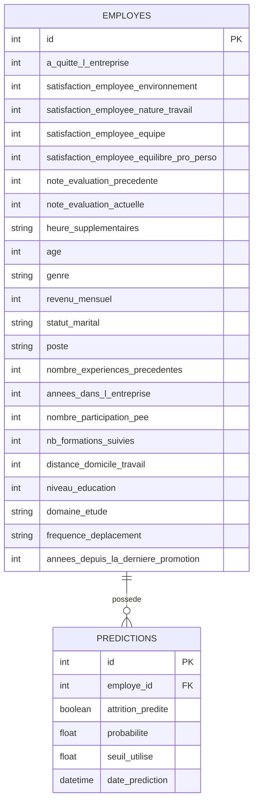

# Déploiement d’un modèle de Machine Learning - Prédiction d'attrition chez une ESN

## Présentation du projet

Contexte : Futurisys, une entreprise innovante souhaite rendre ses modèles de machine learning opérationnels et accessibles via une API performante.

Objectif : Ce projet a pour but de déployer un modèle de machine learning à l'aide d'outils modernes. J'ai choisi le modèle du projet 4 (Identifiez les causes d'attrition au sein d'une ESN (TechNova Partners), cf. https://openclassrooms.com/fr/paths/1047/projects/3146/4343-mission---partie-1---identifiez-les-causes-d'attrition-au-sein-d'une-esn-). Il s'agit d'une classification supervisée visant à prédire le départ d'un employé (attrition) à partir de ses caractéristiques RH.

## Structure du dépôt

- `data/` contient les fichiers CSV d'exemple utilisés pour entraîner le modèle d'attrition.
- `models/` contient le modèle entraîné exporté au format `.joblib`.
- `notebooks/` contient le notebook complet du projet 4 et le notebook d'export du modèle final.
- `src/` contient le code applicatif de l'API FastAPI.
  - `api.py` définit les endpoints HTTP.
  - `schemas.py` définit les schémas Pydantic de validation des données entrantes.
  - `predictor.py` charge le modèle et exécute les prédictions.
  - `features.py` contient le feature engineering utilisé par le pipeline du modèle.
- `tests/` contient les tests automatisés Pytest.
- `sql/` est prévu pour l'étape PostgreSQL du projet.

## Modèle utilisé

Le modèle retenu est un `LightGBMClassifier` avec feature engineering, optimisation des hyperparamètres avec Optuna et seuil de décision personnalisé.

Le pipeline sauvegardé contient :

1. une étape de feature engineering ;
2. un prétraitement des variables numériques et catégorielles ;
3. le modèle LightGBM entraîné.

Le seuil de décision utilisé est `0.371`.

Le modèle est exporté dans : models/modele_lightgbm_attrition.joblib
Le notebook permettant de reconstruire cet export est : notebooks/modele_lightgbm_export.ipynb

L'encodage ordinal, fait manuellement en P4 pour l'analyse, a été intégré au pipeline en P5 pour un artefact auto-suffisant

### Performances du modèle

Le jeu de données est **déséquilibré** (~16 % de départs). L'*accuracy* y serait
trompeuse : un modèle prédisant « aucun départ » atteindrait déjà 84 %
d'accuracy sans aucune utilité. La métrique de pilotage retenue est donc le
**F2-score**, qui pondère le **rappel** deux fois plus que la précision —
cohérent avec l'enjeu RH : mieux vaut **détecter un maximum de départs
potentiels** (rappel élevé), quitte à générer quelques fausses alertes. Le seuil
de décision `0.371` a été optimisé en ce sens, en validation croisée sur les
données d'entraînement.

Performances du modèle retenu (**LightGBM + feature engineering + Optuna**) :

| Métrique | Validation croisée (train) | Jeu de test (294 employés) |
|---|---|---|
| Rappel (*recall*) | 0.70 | 0.55 |
| Précision | 0.49 | 0.40 |
| F2-score | 0.64 | 0.51 |
| F1-score | — | 0.46 |

Le seuil ayant été **figé avant** l'évaluation finale sur le jeu de test, ces
chiffres constituent une estimation honnête de la performance attendue en
production. L'écart entre validation croisée et test (rappel 0.70 → 0.55)
reflète une légère sur-estimation en CV, documentée en toute transparence.

## Pré-requis

- Python 3.14
- uv

## Instructions d'installation

```bash
git clone https://github.com/matthieu3344/projet-5---Deployez-un-modele-de-Machine-Learning
cd projet-5---Deployez-un-modele-de-Machine-Learning
uv sync
```

## Lancer l'API en local

uv run fastapi dev src/api.py
L'API est ensuite disponible à l'adresse : http://127.0.0.1:8000
La documentation Swagger est disponible ici : http://127.0.0.1:8000/docs

## Endpoints disponibles

GET /
Vérifie que l'API répond.

Exemple de réponse :
{
  "message": "L'API est en ligne",
  "statut": "ok"
}

GET /health
Endpoint de santé utilisé pour vérifier que le service est disponible.

Exemple de réponse :
{
  "status": "healthy"
}

POST /predict
Retourne une prédiction d'attrition pour un employé.

Exemple de requête :
{
  "satisfaction_employee_environnement": 2,
  "satisfaction_employee_nature_travail": 4,
  "satisfaction_employee_equipe": 1,
  "satisfaction_employee_equilibre_pro_perso": 1,
  "note_evaluation_precedente": 3,
  "note_evaluation_actuelle": 3,
  "heure_supplementaires": "Oui",
  "age": 41,
  "genre": "F",
  "revenu_mensuel": 5993,
  "statut_marital": "Célibataire",
  "poste": "Cadre Commercial",
  "nombre_experiences_precedentes": 8,
  "annees_dans_l_entreprise": 6,
  "nombre_participation_pee": 0,
  "nb_formations_suivies": 0,
  "distance_domicile_travail": 1,
  "niveau_education": 2,
  "domaine_etude": "Infra & Cloud",
  "frequence_deplacement": "Occasionnel",
  "annees_depuis_la_derniere_promotion": 0
}

Exemple de réponse :
{
  "prediction": "Oui",
  "risque_depart": true,
  "probabilite_depart": 0.858,
  "seuil": 0.371
}

Les données entrantes sont validées avec Pydantic. Par exemple, une valeur invalide pour frequence_deplacement ou un âge inférieur à 18 ans renvoie une erreur 422.

## Tests

### Stratégie de test

La suite de tests (Pytest) combine deux niveaux complémentaires :

- **Tests unitaires** : ils valident une brique isolée, sans dépendance externe
  (modèle ou base). Rapides et déterministes, ils localisent précisément une
  régression. Exemple : la logique du seuil de décision, extraite dans la
  fonction pure `decision_depuis_proba`, est testée avec de simples nombres.
- **Tests fonctionnels** : ils exercent toute la chaîne via des requêtes HTTP
  (grâce au `TestClient` de FastAPI), comme le ferait un vrai client de l'API.
  Ils garantissent que les maillons (validation → prédiction → réponse JSON)
  s'emboîtent correctement.

### Organisation des tests

| Fichier | Niveau | Couvre |
|---|---|---|
| `tests/test_predictor.py` | unitaire | la décision métier selon le seuil (dont le **cas limite** `proba == seuil`) |
| `tests/test_schemas.py` | unitaire | la validation Pydantic (acceptation des entrées valides, **rejet** des invalides) |
| `tests/test_features.py` | unitaire | le feature engineering (médianes apprises au `fit`, formules calculées au `transform`) |
| `tests/test_api.py` | fonctionnel | les endpoints HTTP, les erreurs de validation (422) et la **dégradation gracieuse** de la base |
| `tests/conftest.py` | — | les *fixtures* partagées (ex. un employé valide de référence) |

Quelques scénarios critiques explicitement couverts :

- **Cas limite du seuil** : une probabilité exactement égale au seuil (`0.371`)
  doit prédire un départ (le code utilise `>=`).
- **Scénarios d'erreur** : champ obligatoire manquant ou valeur hors des
  valeurs autorisées renvoient une erreur HTTP 422.
- **Dégradation gracieuse** : si la base PostgreSQL est désactivée ou en panne
  (simulée par *mocking* avec `monkeypatch`), la prédiction aboutit quand même
  et l'API renvoie une réponse valide — l'incident est invisible pour le client.

### Lancer les tests

```bash
uv run pytest
```

La couverture de code (via `pytest-cov`) est calculée automatiquement et
affichée dans le terminal (configuré dans `pyproject.toml`).

### Rapport de couverture

Pour générer un rapport HTML navigable (chaque ligne non testée est surlignée) :

```bash
uv run pytest --cov-report=html
```

Le rapport est écrit dans `htmlcov/` (ouvrir `htmlcov/index.html`). La
couverture globale du code applicatif (`src/`) est de **97 %**, les modules
cœur (`schemas`, `predictor`, `features`) étant couverts à 100 %.

### Contrôle de style

```bash
uv run ruff check src tests
```

## CI/CD

Le projet utilise GitHub Actions pour lancer les tests automatiquement lors des push et pull requests.
Le déploiement continu vers Hugging Face Spaces est configuré via le workflow dédié.

## Modèle de données

Les interactions avec le modèle sont tracées dans une base **PostgreSQL**
structurée en deux tables reliées :

- **`employes`** : les caractéristiques d'un employé (les *inputs* du modèle),
  ainsi que la vérité terrain (`a_quitte_l_entreprise`) archivée pour le
  monitoring.
- **`predictions`** : chaque prédiction produite par le modèle (les *outputs*),
  reliée à l'employé concerné via une clé étrangère.

La relation est de type **un-à-plusieurs** : un employé peut faire l'objet de
plusieurs prédictions au fil du temps. Cette séparation (normalisation) évite
de dupliquer les données de l'employé à chaque nouvelle prédiction.

Le schéma ci-dessous est un **diagramme entité-association (ERD)** :



## Maintenance et mise à jour du modèle

Le modèle est un artefact figé (`models/modele_lightgbm_attrition.joblib`)
contenant le pipeline complet (feature engineering + prétraitement + LightGBM)
et le seuil de décision. Pour le mettre à jour :

1. **Réentraîner** : exécuter `notebooks/modele_lightgbm_export.ipynb`, qui
   reconstruit le pipeline et régénère le fichier `.joblib`.
2. **Vérifier** : relancer la suite de tests (`uv run pytest`) pour s'assurer que
   le nouveau modèle respecte toujours le contrat de l'API (format de sortie,
   bornes de probabilité, valeur du seuil).
3. **Versionner** : committer le nouvel artefact et créer un tag de version
   (ex. `vX.Y.Z`).
4. **Déployer** : pousser sur `main` ; la CI/CD (GitHub Actions) exécute les
   tests puis déploie automatiquement vers Hugging Face Spaces.

### Suivi en production (monitoring)

La base PostgreSQL trace chaque prédiction (table `predictions`) et conserve la
vérité terrain (`a_quitte_l_entreprise` dans `employes`). Ce dispositif permet,
à terme, de comparer prédictions et réalité pour détecter une éventuelle dérive
du modèle (*model drift*) et déclencher un réentraînement.

## Authentification

L'API ne met pas encore en place d'authentification applicative. Cette partie pourra être renforcée dans une étape ultérieure selon les besoins de sécurisation.

## Sécurisation
Les secrets, comme les tokens Hugging Face ou les futurs accès PostgreSQL, ne sont pas commités dans le dépôt.
Ils doivent être fournis via :
un fichier .env en local ;
les secrets GitHub Actions ;
les variables d'environnement de la plateforme de déploiement.

## Gestion Git

Le développement se fait avec des branches dédiées par fonctionnalité, par exemple : git switch -c feature/api-prediction
Une fois la fonctionnalité terminée, elle est intégrée à main via une pull request.