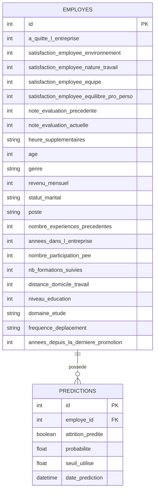

```mermaid
erDiagram
    EMPLOYES ||--o{ PREDICTIONS : possede

    EMPLOYES {
        int id PK
        int a_quitte_l_entreprise
        int satisfaction_employee_environnement
        int satisfaction_employee_nature_travail
        int satisfaction_employee_equipe
        int satisfaction_employee_equilibre_pro_perso
        int note_evaluation_precedente
        int note_evaluation_actuelle
        string heure_supplementaires
        int age
        string genre
        int revenu_mensuel
        string statut_marital
        string poste
        int nombre_experiences_precedentes
        int annees_dans_l_entreprise
        int nombre_participation_pee
        int nb_formations_suivies
        int distance_domicile_travail
        int niveau_education
        string domaine_etude
        string frequence_deplacement
        int annees_depuis_la_derniere_promotion
    }

    PREDICTIONS {
        int id PK
        int employe_id FK
        boolean attrition_predite
        float probabilite
        float seuil_utilise
        datetime date_prediction
    }
```